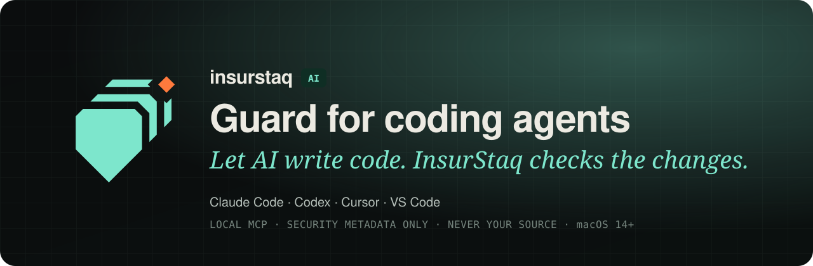

<p align="center">
  <picture>
    <source media="(prefers-color-scheme: dark)" srcset="assets/banner-dark.svg">
    <source media="(prefers-color-scheme: light)" srcset="assets/banner-light.svg">
    
  </picture>
</p>

<p align="center">
  <a href="https://insurstaq.ai"></a>
  
  
  <a href="LICENSE"></a>
</p>

Your coding agent writes the code. **InsurStaq checks what it changed**, on your Mac, before the
change ships. These plugins connect Claude Code, Codex, Cursor and VS Code (GitHub Copilot agent
mode) to InsurStaq Guard. Your agent gets a clear verdict and the file and line to fix. It never
gets your source code from InsurStaq.

<sub>Claude Code, Codex, Cursor, VS Code and GitHub Copilot are named only to describe compatibility. No affiliation or endorsement implied.</sub>

## Quick start

| | |
|---|---|
| **1 · Install InsurStaq** | Get [InsurStaq for Mac](https://insurstaq.ai) 1.0.6 or later, add your repository and run one audit. Guard needs a licence that includes it (Solo and above). |
| **2 · Connect your agent** | In InsurStaq, open **Settings → Coding Agents** and click **Connect…** next to your agent. Nothing changes until you confirm. |
| **3 · Ask before you ship** | Tell your agent: *"Before you finish, verify the changes with InsurStaq and fix anything it blocks."* |

Prefer to set it up by hand? Pick your agent below.

## Install for your agent

<details>
<summary><b>Claude Code</b>: marketplace or one command</summary>

Inside Claude Code:

```text
/plugin marketplace add KarmSakha/insurstaq-plugins
/plugin install insurstaq@insurstaq
```

Or in Terminal:

```sh
claude mcp add --scope user insurstaq -- /Applications/InsurStaq.app/Contents/MacOS/insurstaq-cli mcp
```

Run `/mcp` in Claude Code: `insurstaq` should be connected with five tools. More in [`claude/`](claude/).
</details>

<details>
<summary><b>Codex</b>: one command</summary>

```sh
codex mcp add insurstaq -- /Applications/InsurStaq.app/Contents/MacOS/insurstaq-cli mcp
```

Or copy [`codex/config.toml`](codex/config.toml) into `~/.codex/config.toml`. More in [`codex/`](codex/).
</details>

<details>
<summary><b>Cursor</b>: one link</summary>

Open this link (or click **Connect…** in InsurStaq). Cursor asks you to confirm:

```text
cursor://anysphere.cursor-deeplink/mcp/install?name=insurstaq&config=eyJjb21tYW5kIjoiL0FwcGxpY2F0aW9ucy9JbnN1clN0YXEuYXBwL0NvbnRlbnRzL01hY09TL2luc3Vyc3RhcS1jbGkiLCJhcmdzIjpbIm1jcCJdfQ%3D%3D
```

More in [`cursor/`](cursor/).
</details>

<details>
<summary><b>VS Code with GitHub Copilot</b>: one command</summary>

```sh
code --add-mcp '{"name":"insurstaq","command":"/Applications/InsurStaq.app/Contents/MacOS/insurstaq-cli","args":["mcp"]}'
```

Then **MCP: List Servers** should show `insurstaq`. More in [`copilot/`](copilot/).
</details>

These commands assume InsurStaq is in `/Applications`. **Settings → Coding Agents** in the app
shows and copies them with the exact path on your Mac.

## What your agent gets back

A verdict and where to look. Never your code:

```text
BLOCKED
severity: high
category: authorization
finding: SEC-143
summary: Ownership validation removed
file: src/routes/invoices.ts:42
```

<sub>Illustrative example.</sub>

Your agent already has the repository, so a file and line are enough for it to fix the problem
itself. If an analysis can't finish, the answer is `UNABLE_TO_VERIFY`, never a false pass.

## Private by design

- **InsurStaq never uploads your source code.** Guard and its local server run on your Mac. The server never listens on a network port and makes no network requests.
- **Metadata only.** Answers carry a verdict, severity, category, finding ID, short summary and file location. They never include file contents, snippets, secrets or diffs.
- **Your coding tool is separate.** If it uses a hosted model, it may send code to its own provider. That's between you and that tool.

## The five tools

| Tool | What it does |
|---|---|
| `insurstaq_verify_changes` | Checks the current changes now and returns `PASSED`, `PASSED_WITH_WARNINGS`, `BLOCKED` or `UNABLE_TO_VERIFY`. |
| `insurstaq_list_regressions` | Lists the security regressions introduced since the baseline. |
| `insurstaq_guard_status` | Shows Guard's current state for the project. |
| `insurstaq_get_finding_summary` | Explains one finding (`SEC-143`): severity, CWE and how to fix it. |
| `insurstaq_request_fix` | Queues a fix for you to review in InsurStaq. It never edits files itself. |

## Troubleshooting

| You see | What to do |
|---|---|
| `LICENSE_REQUIRED` | Your plan doesn't include Guard. See [pricing](https://insurstaq.ai/#pricing) or **Settings → License**. |
| `PROJECT_NOT_FOUND` | Add the repository in InsurStaq first. |
| `UNABLE_TO_VERIFY` | Guard couldn't finish (no baseline yet, or a scan is running). Open InsurStaq. |
| The server won't start | Install InsurStaq in Applications, or use **Connect…** in the app, which uses the exact path. |

## Learn more

- [Full reference](docs/REFERENCE.md): how the server works, every field it returns, where the `insurstaq` command comes from, and manual checks.
- [insurstaq.ai](https://insurstaq.ai): InsurStaq for Mac.

## License

The plugin launchers and manifests in this repository are MIT-licensed (see [LICENSE](LICENSE)).
The InsurStaq application and the `insurstaq` command-line tool they start are proprietary
software of KarmSakha Limited and are not covered by this licence.

<p align="center"><sub>Made by KarmSakha Limited · <a href="https://insurstaq.ai">insurstaq.ai</a></sub></p>
